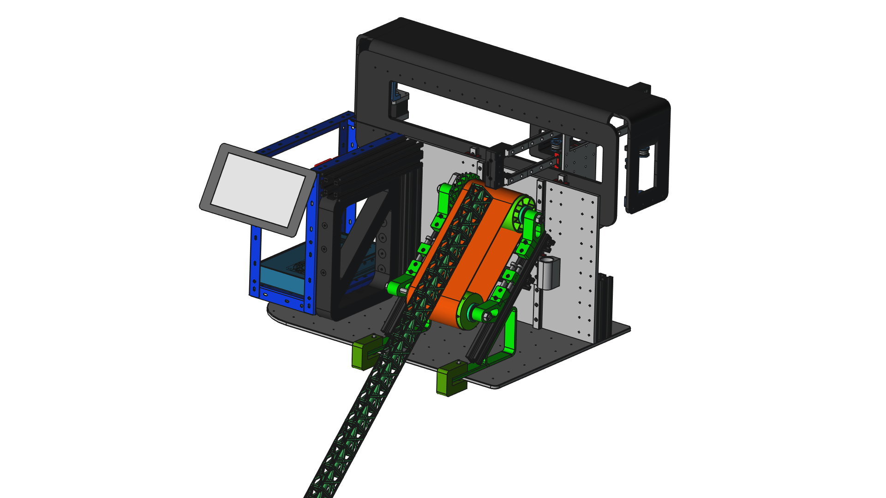
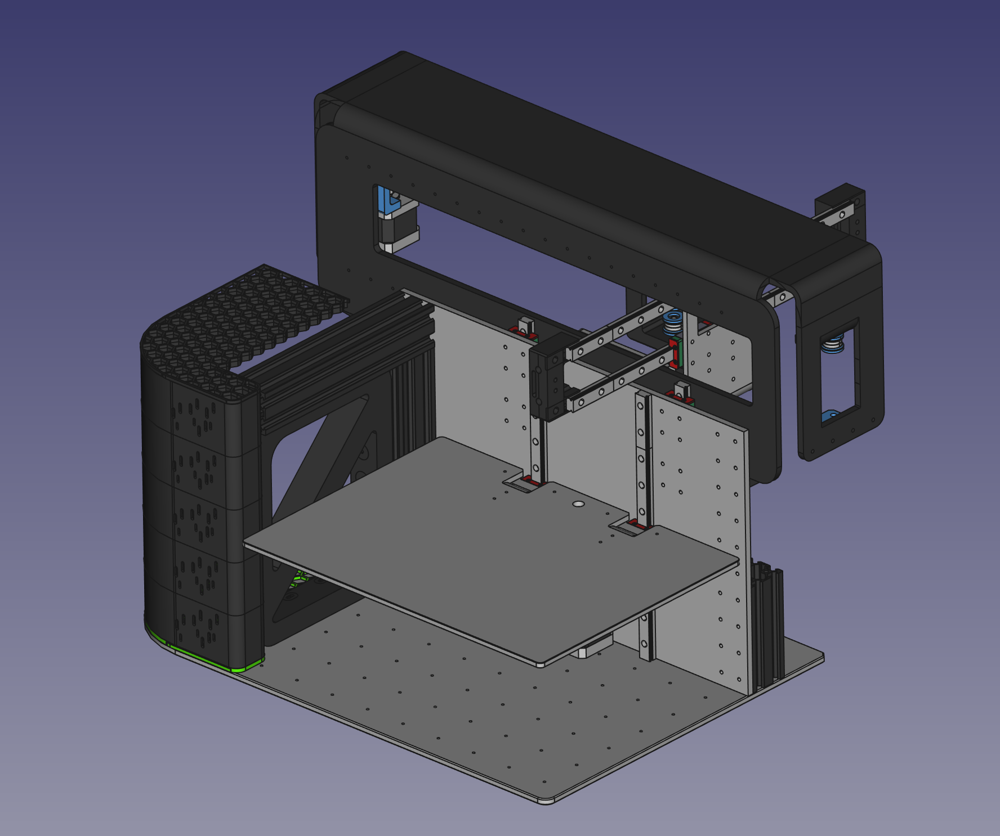

# GA3D-SAK-Bot

a kind of Opensource Swiss Army Knife 3Dprinter for your needs in maker’s activities and in the circular economy.

## Online presence links
[https://linktr.ee/ga3d](https://linktr.ee/ga3d)

## License
CERN Open Hardware Licence Version 2 - Weakly Reciprocal

## Copyright 
© 2015-2024 | GA3D - SAK-Bot | licensed under CERN-OHL-W-2.0 | by Alain David Geiser in Morat/Switzerland | contact via DM on social Media

## Disclaimer
Disclaimer

This source, containing the design of a multifunctional 3Dprinter/machine, is provided by the authors {GA3D} on an “as-is” basis, without any express of implied warranties of any kind, including of merchantability, satisfactory quality, fitness for a particular purpose, compliance with standards or regulatory requirements, or the non-infringement of third party rights in its production, distribution and use.

---------------------------------------------------
The autors of this Hardware/Software accept absolutely no liability for any harm or loss resulting from its use. 

It is extremely unwise to rely on Hardware/Software alone for safety.

Any machinery capable of harming persons must have
provisions for completely removing power from all
motors, etc, before persons enter any danger area.

All machinery must be designed to comply with local 
and national safety codes, and the authors of this 
software cannot and do not, take any responsibility 
for such compliance.

---------------------------------------------------

